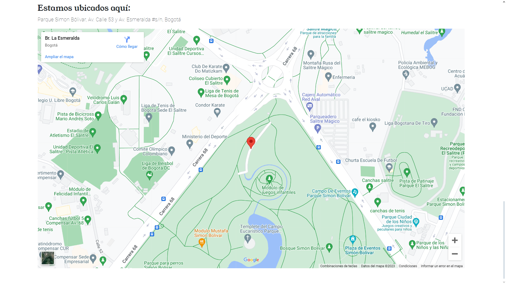

## LANDING PAGE ELABORADA CON HTML, CSS Y BOOTSTRAP

## INSTRUCCIONES

1. Descargar la carpeta completa de la landing page.

2. Abrir el documento "Home.html" con un navegador.

3. Navegar en la página principal con algunos links como el de ubicación.